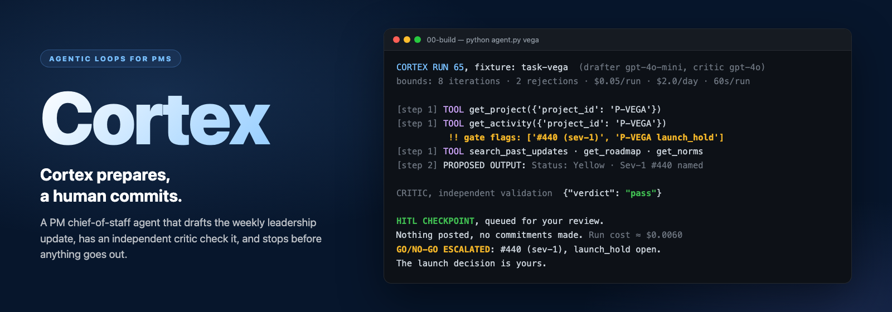

# Cortex: PM Chief-of-Staff Agent



My final project for Product School's **Agentic Loops for PMs** certification, one folder per module, Sep 14 to 30, 2026. **Pitch deck:** [antje.github.io/product-school-agentic-workflows/pitch.html](https://antje.github.io/product-school-agentic-workflows/pitch.html) (source: [`pitch.html`](pitch.html)).

## The short path

1. **Problem.** Every Monday a PM loses the morning stitching a leadership update together from Slack threads, merged PRs and Jira tickets. The writing is the easy part. The costly mistakes are reporting Green on a launch with an open Sev-1, or letting an embargoed project slip into a company-wide post.
2. **Bet.** Cortex pulls the week's data, drafts the update and a capped story batch, has an independent critic check the draft, and stops in a review queue. It holds no tool that can post, merge or commit a date.
3. **Prototype.** It runs end to end on the course's fixture data, with six run screenshots and every trace kept: [`06-autonomy/prototype.md`](06-autonomy/prototype.md).
4. **Why build it.** Drafting is a commodity any vendor can add. This team's agent line is not: its norms as code gates, its embargo list stripped at the tool, its review queue, its dial per segment. If a vendor offers those as configuration, buy it, and this repo's evals become its acceptance test.
5. **Evidence today.** All nine eval cases pass, 3 of 3 runs each, scored in code by `evals.py`. That proves system behavior on fixtures I wrote, against pass conditions I set, not judgment on real data.
6. **Biggest unknown.** Whether, on a real team's data, PMs review the drafts properly instead of approving them on sight, and whether reviewing is faster than writing.
7. **Next test.** Four weeks of read-only shadow on one team (the ask below). It either clears Cortex to assisted or triggers the [stop rule](06-autonomy/production-and-autonomy.md#widen-autonomy-decision-rule).

**All evidence comes from runs on the course's fixture data**, a week-of-2026-07-06 snapshot of three projects. Cortex has not read a real Jira, GitHub or Slack source yet.

| Where it stands | Number | Where it comes from |
|---|---|---|
| Trust rung today | **Shadow** | it behaves like supervised on fixtures (every output waits in the review queue), but it has never run on real inputs |
| Trajectory evals | **9 of 9 passing** | `python evals.py`, 3 runs per case, $0.07 for the pass. N = 3 is a small sample, the fixtures and pass conditions are mine, and on EV-8 and EV-9 the pass measures the code screen: the drafter itself failed every time. The CI bar is 20 runs per case ([`bounds-and-evals.md`](05-bounds-evals/bounds-and-evals.md), section 3) |
| Model cost per run | **$0.007 typical, $0.02 worst** | measured; the per-run cap of $0.05 is 2.5 times the worst case |
| Bounds and screens | **in code** | caps, timeout, kill switch, an injection screen on the brief, a scope screen on every draft, a Sev-1 gate; none rests on the prompt alone |
| Write tools | **0** | Cortex reads, advises and queues; a human approves every status, post, story and go/no-go |

**What Cortex may do.** It **reads** the project record, this week's activity, past updates, the shareable roadmap and the norms. It **advises** on the status colour and on what to escalate. It **writes** only to the review queue and its own ledger. **A human approves** the status, every post, the creation of any story, and every go/no-go.

**The ask.** Four weeks of read-only access to one team's Jira, GitHub and Slack, and one PM who logs how long their own weekly update takes. **It returns** the shadow-gate result (status agreement with the PM's own update, invented figures, escalations and who answered them) and the time-saved baseline.

**The hard no.** No post tool, ever, for any segment. It rules out auto-posting even routine updates, auto-closing tickets, and committing dates.

---

## The story this repo tells

This repo is the build journey of one agent, Cortex, laid out in the order a PM makes the decisions. Each folder is one framework from the course, and each ends in a validation point, a deliverable, a validator or an eval, that proves the step before the next one builds on it.

| # | The decision | Framework | Folder | What it settled for Cortex |
|---|---|---|---|---|
| 1 | **Draw the line:** what the agent owns and what stays human, before anything runs | The Agent Line | `01-agent-line/` | Cortex pulls, drafts and flags; a human sets the status, chooses what to escalate, and owns every post |
| 2 | **Make it loop:** when it fires and when it stops | Loop Engineering | `02-loop-design/` | A hook loop with a cron backup; eleven exits it can detect ★ |
| 3 | **Grow the team only with a reason:** split only where a split earns it | Orchestration | `03-orchestration/` | One split, an independent critic with five yes-or-no checks ★ |
| 4 | **Feed it context:** the right data each run, without leaking or drifting | Context Engineering & Memory | `04-memory-context/` | Retrieve or include per source; embargoed items never reach the model |
| 5 | **Bound it and prove it:** design for when it goes sideways | Bounds, Trust & Evals | `05-bounds-evals/` | Bounds in code; nine trajectory evals, run by an eval runner |
| 6 | **Ship and widen trust:** how far it may go, and how it earns more | Autonomy & the Trust Ladder | `06-autonomy/` | Shadow today, a gate to assisted, a dial per segment, a stop rule ★ |

---

## Deliverables at a glance

| # | Deliverable | Module | File |
|---|---|---|---|
| 1 | **Working prototype**, with six run screenshots | built across all six | [`06-autonomy/prototype.md`](06-autonomy/prototype.md) |
| 2 | **Loop Spec** | M2 | [`02-loop-design/loop-spec.md`](02-loop-design/loop-spec.md) |
| 3 | **Orchestration Map** | M3 | [`03-orchestration/orchestration-map.md`](03-orchestration/orchestration-map.md) |
| 4 | **Bounds, trust & autonomy** | M5, M6 | [`06-autonomy/production-and-autonomy.md`](06-autonomy/production-and-autonomy.md) |
| 5 | **Build insights** | M6 | [`06-autonomy/build-insights.md`](06-autonomy/build-insights.md) |

Supporting artifacts: [`01-agent-line/agent-line-map.md`](01-agent-line/agent-line-map.md), [`04-memory-context/memory-and-context.md`](04-memory-context/memory-and-context.md), [`05-bounds-evals/bounds-and-evals.md`](05-bounds-evals/bounds-and-evals.md).

## The agent in one sentence

Cortex is a chief-of-staff for a product team: it pulls project state and activity, drafts the weekly leadership status update, flags at-risk items, and queues a capped batch of backlog stories for approval. It decides what to draft and what to flag. A human sets the status and commitment level, chooses what to escalate, and owns every post. The full line, scored and pressure-tested, is in `01-agent-line/agent-line-map.md`.

## Build & demo

- **How it was built:** Claude Code, directed from each module's `LAB.md`. The agent in `00-build/` runs on Python 3.14 against the OpenAI API: `gpt-4o-mini` drafts, `gpt-4o` critiques. Each module changed the build to match its artifact: the loop's exits and dedupe by task ID (M2); a five-check critic with a tiered fail action (M3); retrieval that withholds embargoed items and a gate that holds any draft built without this week's activity (M4); a timeout, per-run and daily spend caps, a kill switch and an injection screen (M5); a code gate that holds any Green status while a launch hold or Sev-1 is open, a scope screen that holds any draft naming an embargoed or other project, the kill switch as a deployment flag, and an eval runner (`00-build/evals.py`) that scores all nine cases in code (M6).
- **Demo link:** none; Cortex runs locally on fixture data. The six run screenshots and how to reproduce them are in [`06-autonomy/prototype.md`](06-autonomy/prototype.md).
- **Run screenshots:** all 6, in `06-autonomy/screenshots/`. Every run behind the deliverables is kept verbatim in [`06-autonomy/traces/`](06-autonomy/traces/), with two cold reviews of the work.

## Where it sits on the Trust Ladder

**Shadow, on real data.** The gate to assisted is 4 weekly cycles and at least 20 shadow drafts at the thresholds in [`production-and-autonomy.md`](06-autonomy/production-and-autonomy.md#trust-ladder); one trust incident resets the window.

- **Autonomy dial:** the project-owning PM can climb to bounded-autonomous for the routine weekly draft; a new eng lead stays supervised; an exec stakeholder stays assisted. The dial never moves the agent line.
- **Deployment:** serverless, triggered by the hook loop plus a weekly cron sweep; owner Antje Barth, backup the project's eng lead; pause with the `CORTEX_KILL` flag.
- **What I learned:** I realized the safest part of Cortex is what it cannot do. Every guard I wrote failed at least once; the missing post tool never did. Full reflection in [`06-autonomy/build-insights.md`](06-autonomy/build-insights.md).

---

## Repo structure

```
product-school-agentic-workflows/
├── README.md                          ← this page
├── pitch.html                         ← the pitch deck
├── 00-build/                          ← the running Cortex agent
│   ├── agent.py · critic.py · tools.py · prompts.py
│   ├── evals.py                       ← runs and scores the nine eval cases
│   ├── .env.example                   ← model, bounds and kill-switch settings
│   └── fixtures/                      ← the week-of-2026-07-06 data pack and the task briefs
├── 01-agent-line/agent-line-map.md    ← M1: what Cortex owns and what stays human
├── 02-loop-design/loop-spec.md        ← M2: the Loop Spec                 ★ Deliverable 2
├── 03-orchestration/orchestration-map.md ← M3: one split, the critic   ★ Deliverable 3
├── 04-memory-context/memory-and-context.md ← M4: retrieve or include, memory scope
├── 05-bounds-evals/bounds-and-evals.md ← M5: bounds in code, nine trajectory evals
└── 06-autonomy/
    ├── prototype.md                   ← demo and six screenshots           ★ Deliverable 1
    ├── build-insights.md              ← friction, learning, aha            ★ Deliverable 4
    ├── production-and-autonomy.md     ← dial, Trust Ladder, governance     ★ Deliverable 5
    ├── screenshots/                   ← the six run captures
    └── traces/                        ← every run, verbatim, and the cold reviews
```
